# Catholic Diocese of Hwange - Zimbabwe
## Sacramental Records Management System (SRMS) — Illustrated ERP Operations Manual
**Version 3.0 • Gold Standard Academic, Canonical, & Technical Guide**

---

## 1. Executive Summary: The Diocesan Sacramental ERP

The Catholic Diocese of Hwange - Zimbabwe Sacramental Records Management System (SRMS) is a customized **Enterprise Resource Planning (ERP) database system** engineered specifically to manage and protect the spiritual capital, member lifecycles, physical assets, and administrative workflows of the diocese under a unified data framework.

Unlike disconnected spreadsheets or basic database interfaces, the Hwange SRMS functions as an integrated **Administrative ERP Engine** where every entity is canonically and relationally linked:

```mermaid
graph TD
    PR[Faithful/Parishioner Registry] --> BP[Baptism Module (Canon 849)]
    PR --> CO[Confirmation Module (Canon 879)]
    PR --> MA[Matrimony Module (Canon 1055)]
    PR --> DE[Burial & Death Module (Canon 1176)]
    BP --> NT[Canonical Notations (Canon 535)]
    CO --> NT
    MA --> NT
    DE --> NT
    PR --> CL[Clergy Assignments & Movements]
    PR --> AS[Parish Assets & Land Registry]
    CH[Chancery Office] --> Ticket[Communication Hub Tickets]
    Ticket --> PR
```

### Core ERP Pillars
1. **Integrated Member Lifecycle Management**: Tracks a parishioner's canonical milestones from birth (Faithful Registry) to spiritual entry (Baptism), spiritual growth (Communion, Confirmation), covenant (Marriage), ministry (Vocation/Ordination), to eternity (Burial).
2. **Canonical Workflow Compliance**: Automatically validates requirements dictated by the Code of Canon Law (CIC 1983). For example, it prevents confirmations or marriages from being registered without verifying existing baptismal status, and implements automatic notation back-references under **Canon 535**.
3. **Parish Resource & Asset Registry**: Features a built-in module for parishes to inventory land holdings, buildings, and community assets, ensuring complete stewardship and transparency.
4. **Unified CRM & Ticketing**: The *Communication Hub* acts as a secure Customer Relationship Management (CRM) ticket system, allowing local parishes to securely submit official registry correction requests or dispensation petitions to the Bishop's Chancery.
5. **Business Intelligence (BI) Analytics**: Provides the Bishop's office with granular sacramental analytics, demographic trajectories, age-segregated canonical growth trends, and deanery density maps for strategic pastoral planning.

---

## 2. Table of Contents
1. [System Access & Security (Sign In)](#3-system-access--security-sign-in)
2. [The Unified Dashboard](#4-the-unified-dashboard)
3. [The Faithful Registry (Parishioners)](#5-the-faithful-registry-parishioners)
4. [Sacramental Entry: Baptism (Canon 849)](#6-sacramental-entry-baptism-canon-849)
5. [Sacramental Entry: Confirmation (Canon 879)](#7-sacramental-entry-confirmation-canon-879)
6. [Sacramental Entry: Matrimony (Canon 1055)](#8-sacramental-entry-matrimony-canon-1055)
7. [Sacramental Entry: Death & Christian Burial (Canon 1176)](#9-sacramental-entry-death--christian-burial-canon-1176)
8. [The Canonical Certificate Generation Engine](#10-the-canonical-certificate-generation-engine)
9. [Annua Statistica OMEGA: Annual Statistics & Finance](#11-annua-statistica-omega-annual-statistics--finance)
10. [The Canonical Communication Hub](#12-the-canonical-communication-hub)
11. [Legacy Data Capture & OCR Digitization Workflow](#13-legacy-data-capture--ocr-digitization-workflow)
12. [Offline-First Architecture & The Parish Sync Engine](#14-offline-first-architecture--the-parish-sync-engine)
13. [System Security: Audit Logging & Backup Protocols](#15-system-security-audit-logging--backup-protocols)
14. [Secure Session Termination (Sign Out)](#16-secure-session-termination-sign-out)
15. [System Policy: Privacy, Terms & Conditions](#17-system-policy-privacy-terms--conditions)
16. [Technical Appendices & Canonical Mapping](#18-technical-appendices--canonical-mapping)

---

## 3. System Access & Security (Sign In)

Accessing the Diocesan ERP requires role-based authentication to safeguard highly sensitive personal and canonical records.

### Step-by-Step Instructions
1. Ensure the system is running by double-clicking the `LAUNCH_RMS.bat` file in your root installation directory. This starts the portable PHP environment.
2. Open your web browser and enter the address: `http://localhost:8000`.
3. In the login interface:
   * **Username**: Enter your official assigned username (e.g., `fr_john_ndlovu`).
   * **Password**: Enter your secure password (e.g., `SecurePassword123!`).
4. Click the blue **Sign In** button.

> [!IMPORTANT]
> **Password Policy**: If logging in for the first time, you will be prompted to change your temporary password. Passwords must include capital letters, numbers, and special symbols to comply with diocesan security rules.

### Visual Reference
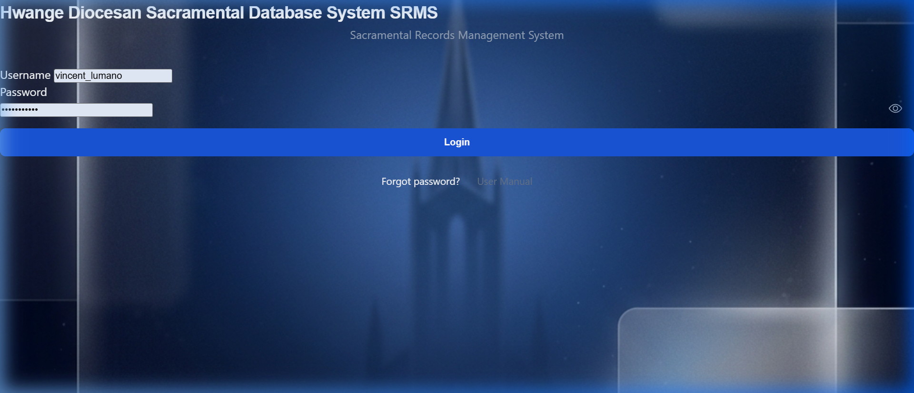

---

## 4. The Unified Dashboard

Once signed in, you are presented with the **Unified Dashboard**. This is the administrative "Command Center" of your parish, providing real-time data insights, registration trajectories, and quick access tools.

### Key Features
* **Universal Search**: Located at the top of the interface, allowing you to instantly find parishioners by first name, last name, or baptismal number.
* **Oversight Metric Cards**: Real-time totals of your parish registers:
  * **Active Faithful**: Total parishioners currently registered.
  * **Sacramental Metrics**: Quick tally counts of Baptisms, Confirmations, and Marriages.
  * **Pending Notifications**: Urgent tickets or canonical updates from the Chancery.
* **Navigation Sidebar**: Collapsible menu to jump to the Faithful Registry, individual Sacraments, Communication Hub, and Clergy Management.

### Visual Reference
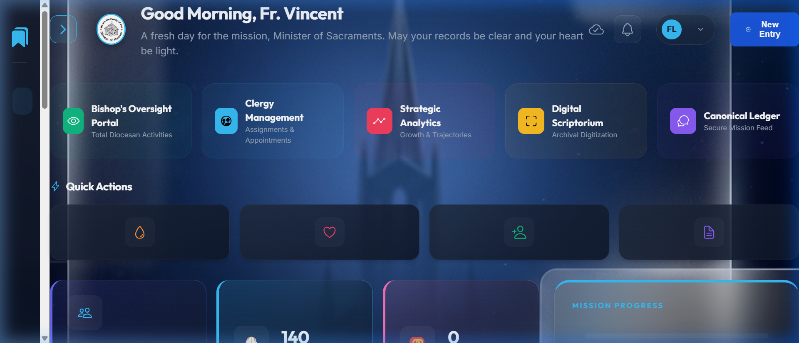

---

## 5. The Faithful Registry (Parishioners)

Before adding any sacrament, the individual **must first exist in the Parishioners Registry**. This ensures strict database normalization and prevents orphaned records.

### Step-by-Step Instructions
1. Navigate to the **Parishioners** page via the sidebar or `http://localhost:8000/parishioners.php`.
2. To find an existing parishioner, use the active **Search Bar** to filter by name or status.
3. Review status tags:
   * `[ACTIVE]`: Parishioner is in good standing and lives within parish boundaries.
   * `[MIGRANT]`: Transferred temporarily to another diocese or location.
   * `[DECEASED]`: Locked for any sacramental changes.
4. To register a new parishioner, click **Register New Parishioner** and enter their legal name, baptismal name, date of birth, gender, and contact details.

### Intelligent Duplicate Registry Protection
To prevent accidental record duplication, the system features a **Real-Time Asynchronous Duplicate Detection Engine**:
* **Automatic Background Check**: As soon as you type a first and last name in the *Register Faithful* form, the system queries the Diocesan database in the background without reloading the page.
* **Instant Amber Warning Alert**: If an identical name is already registered, a glassmorphic amber warning card instantly expands in the interface.
* **Granular Match Details**: The card lists matching records along with their Date of Birth, Gender, registered Parish/Mission, and current Membership Status, allowing you to instantly verify if this person is already registered in another mission or has an existing active record.

### Visual Reference
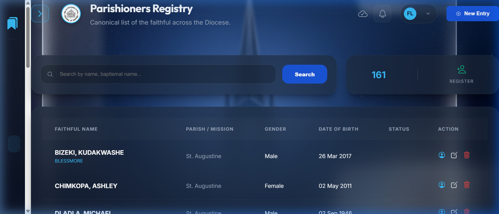

---

## 6. Sacramental Entry: Baptism (Canon 849)

Baptism is the gateway to the sacraments. Under Canon Law (CIC 849), accurate records must be kept of each baptism performed in the parish.

### Step-by-Step Instructions
1. Navigate to **Baptisms** in the sidebar, and click **Add Baptism Record** (or go to `http://localhost:8000/sacraments/baptism_add.php`).
2. **Parishioner Linking**: Select the parishioner from the dropdown list.
3. Fill in the canonical fields:
   * **Christian/Baptismal Name**: The name given at baptism.
   * **Date of Baptism**: The date the sacrament was administered.
   * **Location of Baptism**: Usually the Parish Church, or outstation chapel.
   * **Minister**: The priest or deacon who administered the sacrament.
   * **Father & Mother**: Parents' full names (including mother's maiden name).
   * **Godparents/Sponsors**: Full names of godparents.
4. Click **Save Baptism Record**.
5. Once saved, you can print the official **Baptism Certificate** with a single click.

### Visual Reference
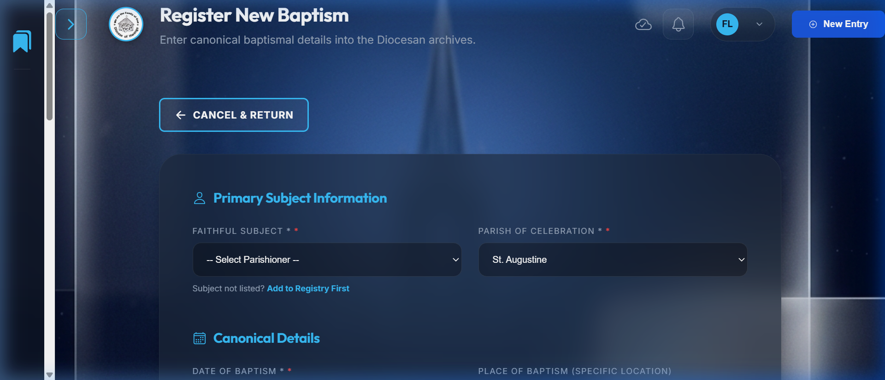

---

## 7. Sacramental Entry: Confirmation (Canon 879)

Confirmation seals the baptized with the gift of the Holy Spirit. Canon 879 dictates the detailed logging of confirmation records including sponsors.

### Step-by-Step Instructions
1. Navigate to **Confirmations** in the sidebar, and click **Add Confirmation Record** (or go to `http://localhost:8000/sacraments/confirmation_add.php`).
2. Select the candidate from the **Parishioner** list.
3. Enter the details:
   * **Confirmation Name**: The patron saint name chosen by the candidate.
   * **Date of Confirmation**: The liturgical date of administration.
   * **Presiding Minister**: Usually the Bishop of Hwange, or delegated priest.
   * **Sponsor**: The name of the confirmation sponsor.
   * **Baptism Ref**: Cross-reference details to verify baptismal status.
4. Click **Save Confirmation Record**.

### Visual Reference
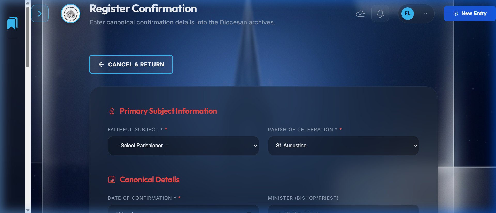

---

## 8. Sacramental Entry: Matrimony (Canon 1055)

The matrimonial register logs the covenant between groom and bride. Canon 1055 requires precise validation and recording, including prenuptial investigations and dispensations.

### Step-by-Step Instructions
1. Navigate to **Marriages** in the sidebar, and click **Add Marriage Record** (or go to `http://localhost:8000/sacraments/marriage_add.php`).
2. Select the **Groom** and **Bride** from your parish registry.
3. Input canonical data:
   * **Marriage Date & Location**: The date and church/outstation of the wedding.
   * **Officiating Minister**: The priest or deacon celebrating the mass.
   * **Witnesses**: Full names of the official witnesses (usually best man and maid of honor).
   * **Dispensations & Notes**: Add any canonical dispensations granted by the Bishop (e.g., disparity of cult) or prenuptial findings.
4. Click **Save Marriage Record** to finalize.

### Visual Reference
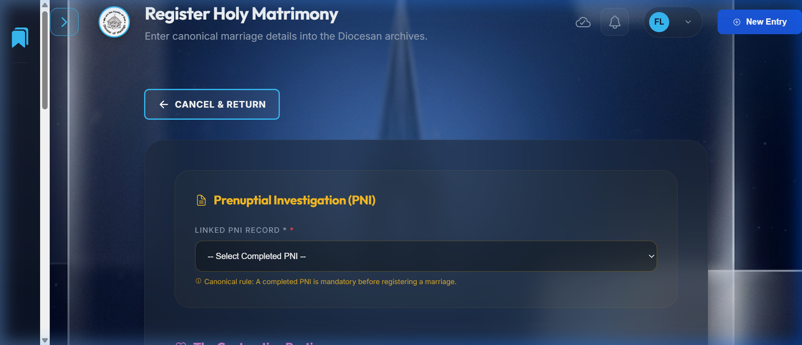

---

## 9. Sacramental Entry: Death & Christian Burial (Canon 1176)

When a parishioner goes to their eternal rest, they must be registered in the Burial/Death Registry. This locks their record, ensuring no further sacraments are mistakenly registered.

### Step-by-Step Instructions
1. Navigate to **Deaths/Burials** in the sidebar, and click **Add Burial Record** (or go to `http://localhost:8000/sacraments/burial_add.php`).
2. Select the deceased parishioner from the dropdown list.
3. Fill in the fields:
   * **Date of Death**: The actual date of passing.
   * **Date of Burial**: The date of the ecclesiastical funeral.
   * **Location**: Place of burial or cemetery.
   * **Officiating Minister**: The priest who performed the rites.
   * **Cause of Death & Age**: Demographic data for statistical returns.
   * **Last Sacraments**: Log whether they received the Viaticum/Anointing of the Sick before passing.
4. Click **Save Death Record**.

### Visual Reference
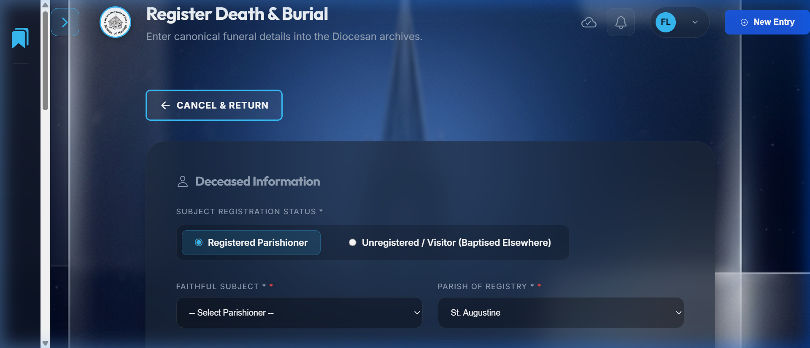

---

## 10. The Canonical Certificate Generation Engine

One of the most advanced subsystems of this ERP is the **A4 Print-Compliant Certificate Generation Engine**. It allows instant generation of certificates for Baptism, First Holy Communion, Confirmation, and Marriage directly from the saved records, with embedded canonical verification mechanisms.

### Key Functional Features
1. **Dynamic Multi-Language Engine**: Translate canonical terms with a single click to serve the multilingual community of the Hwange Diocese. Sacramental certificates can be fully generated in: **Nambya, Tonga, Chewa, English, Latin, Ndebele, and Shona**.
2. **Interactive Aesthetics/Theme Selector**: Customize the print look for parish presentation:
   * **Classic**: Traditional black and gold-accented administrative layout.
   * **Heirloom Edition ✨**: Stunning premium design with gold-embossed corners, a centralized diocesan geometric watermark, and a double-bordered, high-density printable layout suitable for archiving and framing.
   * **Gold Leaf**: Features warm wood/reddish margins for solemn celebrations.
   * **Traditional Latin**: High-contrast, formal, double-lined monochrome typography for formal transcripts.
   * **Modern Minimal**: Sleek, borderless flat-design layout.
3. **Double Verification Security Integrations**:
   * **Social Communications Commission Stamp**: A high-fidelity digital seal embedded directly in the background layout to replace manual rubber stamping.
   * **QR Code & Verification GUID**: Generated dynamically using SHA-256 hashing. Diocesan chanceries or external parishes can scan the printed certificate's QR code using any smartphone to instantly cross-reference it against the live Hwange Sacramental Database, preventing certificate falsification and registry fraud.

### Step-by-Step Printing Instructions
1. Open the list view of the sacrament (e.g. *Baptisms* or *Marriages*).
2. Click **Print Certificate** next to the specific record.
3. Use the **Theme Selector** in the sticky top banner to change the visual layout (e.g., click *Heirloom*).
4. Choose the local community's **Language** from the dropdown menu (e.g., **Nambya, Tonga, Chewa, English, Latin, Ndebele, or Shona**).
5. Click **Print**. The system automatically suppresses the top theme selector and navigation bars during printing, outputting only the A4 margins.

### Visual Reference: Classic Edition (Pre-selection)
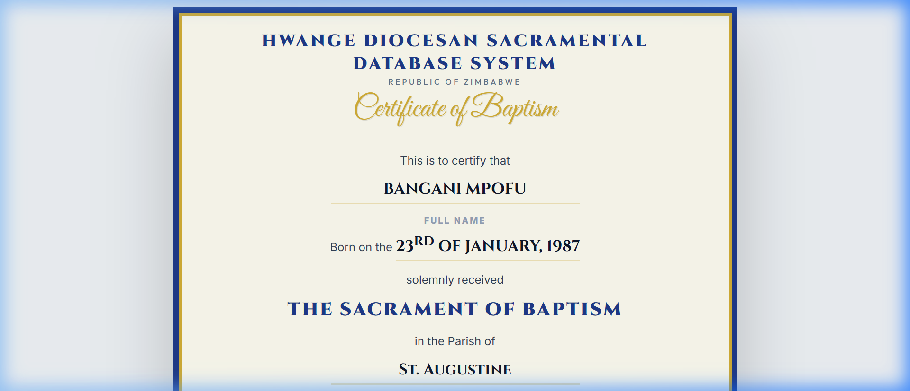

### Visual Reference: Heirloom Edition (Gold Embossed Watermarked Canvas)
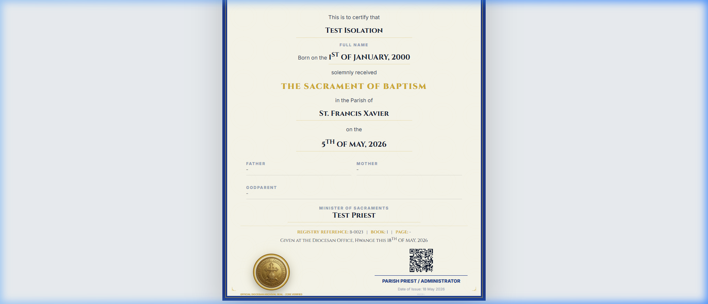

### Visual Reference: Marriage Certificate
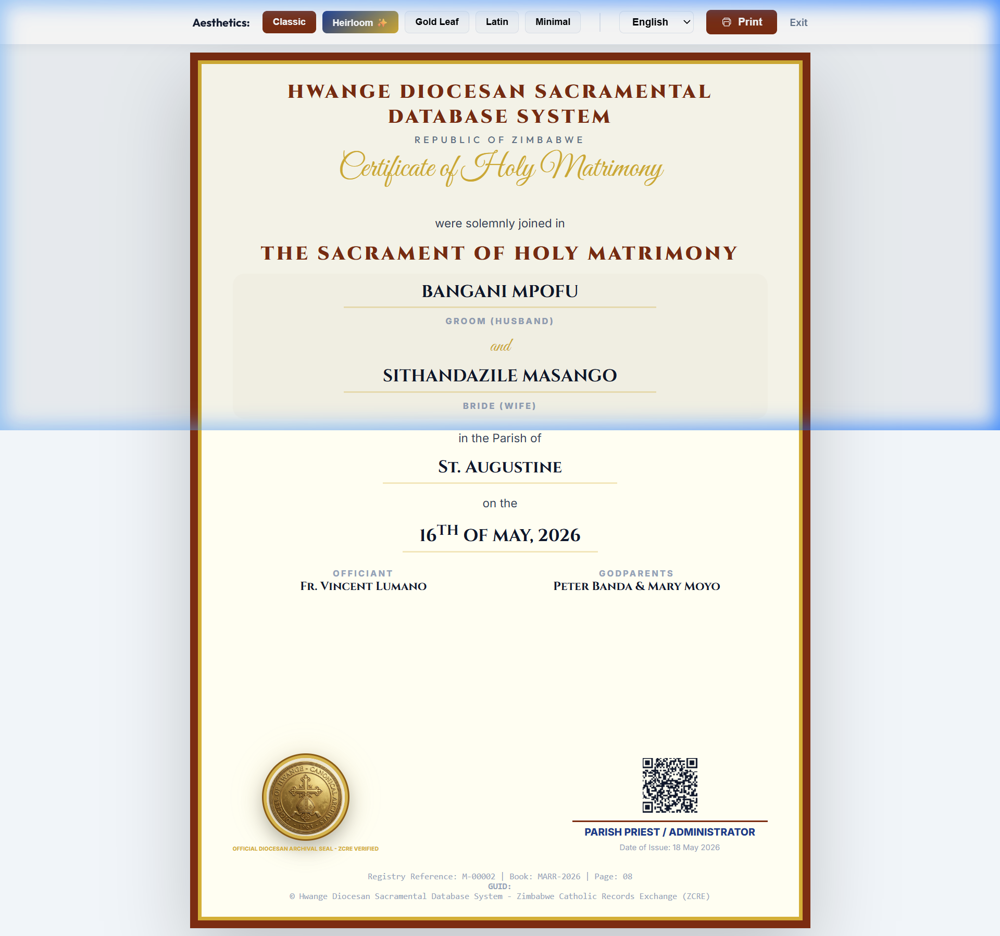

---

## 11. Annua Statistica OMEGA: Annual Statistics & Finance

The **Annua Statistica OMEGA** engine is the central administrative reporting core of the Diocesan ERP (v3.0). Historically, compiling the yearly diocese-wide statistical return (*Annua Statistica*) for the Holy See in Rome took months of manual book-by-book audits and calculations. The OMEGA subsystem automates this entire pipeline under the principle of **Total Accountability** (Zero Suppression & Exhaustive Metrics).

### Core Features of the OMEGA Reporting Engine
* **The 10 Mandatory Archival Modules**: Consolidates your entire mission's canonical data into one structured canvas:
  &nbsp;&nbsp;&nbsp;&nbsp;**I. Churches and Pastoral Centres**: Active mass centres, Blessed Sacrament holdings, and attendance.<br/>
  &nbsp;&nbsp;&nbsp;&nbsp;**II. Governance and Personnel**: Full census of resident priests (diocesan/religious), deacons, brothers, sisters, and catechists.<br/>
  &nbsp;&nbsp;&nbsp;&nbsp;**III. Vocations Pipeline**: Tracks Philosophy, Theology, and Major/Minor seminarians.<br/>
  &nbsp;&nbsp;&nbsp;&nbsp;**IV. Parish Guilds & Sacramental Milestones**: Member tracking for parish guilds (Legion of Mary, St. Anne, CYA, Sacred Heart) and sacramental counts (First Communions, Anointings, RCIA).<br/>
  &nbsp;&nbsp;&nbsp;&nbsp;**V. Education Matrix**: Detailed gender-segregated student enrollment and religious/lay teacher counts across preschools, primary, secondary, and vocational institutions.<br/>
  &nbsp;&nbsp;&nbsp;&nbsp;**VI. Exhaustive Health & Care Matrix**: Audits mission hospitals, clinics, maternity units, elderly homes, and orphanages, tracking inpatient/outpatient demographics, mortality, and emergency clinical baptisms.<br/>
  &nbsp;&nbsp;&nbsp;&nbsp;**VII. Financial Ledger**: Standardized 14-line ledger tracking parish incomes and chancery contributions.<br/>
  &nbsp;&nbsp;&nbsp;&nbsp;**VIII. Status Animarum**: Active demographic tracking balancing births, immigration, deaths, and emigration.<br/>
  &nbsp;&nbsp;&nbsp;&nbsp;**IX. Marriage Accountability**: Canonical breakdown of Matrimony registries (Catholics, Mixta Religio, Disparitas Cultus).<br/>
  &nbsp;&nbsp;&nbsp;&nbsp;**X. Observations**: Text-area for qualitative pastoral challenges.
* **Standardized Multi-Currency Financial Ledger**: Fully accounts for parish resources with built-in multi-currency selection supporting:
  * **USD** (United States Dollar)
  * **ZiG** (Zimbabwe Gold)
  * **ZAR** (South African Rand)
  * **BWP** (Botswana Pula)
  Tracks Parish Tithes, Offertory Cash/Kind, Peter's Pence, and Caritas collections with strict double-entry ledger security.
* **Smart Autocompletion Integration**: The system automatically queries your SQLite records to fetch verified Baptism, Matrimony, and Burial numbers for the selected reporting year, eliminating clerical counting errors.

### Step-by-Step Reporting Instructions
1. Navigate to **Parish Reports** in the sidebar (or go to `http://localhost:8000/dashboard/parish_reports.php`).
2. Select your **Parish/Mission** and the desired **Reporting Year** (e.g. `2026`).
3. Fill in the required fields in the left-hand form sidebar.
4. Click **Submit Total Archive** to permanently commit the records to the secure Diocesan vault.
5. In the right-hand **Annua Statistica** preview, review the generated report layout.
6. Click **Export Final Canonical PDF**. The system uses a specialized high-resolution rendering pipeline (html2pdf worker) that automatically inserts the Bishop's Diocesan Seal, generates running page numbers, and aligns signature fields for the Parish Priest and Chancellor.

### The OMEGA Operations Reference Manual
If a parish clerk or priest needs offline guidance, clicking **View OMEGA User Manual** dynamically launches the local manual (`omega_manual.php`), which provides an offline-accessible, print-friendly copy of these steps.

---

## 12. The Canonical Communication Hub

To streamline registry corrections, dispensation requests, and administrative assistance, the system features a built-in **Communication Hub** which connects your parish registry directly with the Chancery.

### Step-by-Step Instructions
1. Navigate to **Communication Hub** in the sidebar or go to `http://localhost:8000/communication_hub.php`.
2. To submit a request, click **New Support Ticket**.
3. Choose the appropriate category:
   * **Registry Correction**: For fixing misspelled names or incorrect dates in locked historical records.
   * **Dispensation Request**: To submit canonical forms to the Bishop's office.
   * **General Query / Technical Support**: For local system issues.
4. Select priority level (**Low, Medium, High, URGENT**).
5. Type your message and click **Submit Request**.
6. Track responses directly from the active message dashboard thread.

### Visual Reference
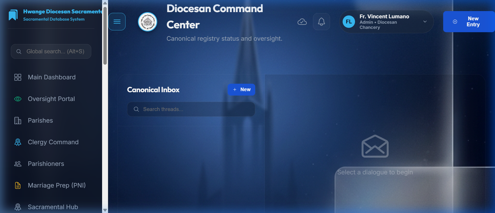

---

## 13. Legacy Data Capture & OCR Digitization Workflow

For decades of pre-digital paper archives, the Hwange Diocesan ERP provides a structured, high-accuracy **Legacy Data Digitization Framework** combining high-resolution scanning, AI-driven handwriting recognition, and a secure human validation interface.

### The Digitization Pipeline

```
[Physical Registry Book]
         │
         ▼
[Overhead/Flatbed Scanner] ──► Raw Image (TIFF/PNG, 300+ DPI)
         │
         ▼
[Image Pre-Processing] ────► Contrast Optimization, Binarization, Skew Correction
         │
         ▼
[HTR / Advanced OCR] ──────► Handwritten Text Recognition & Column Extraction
         │
         ▼
[Canonical Lexicon Check] ──► Latin Translation & Parish Name Correction
         │
         ▼
[Human Verification UI] ───► Clerk Side-by-Side Validation
         │
         ▼
[SQLite Integration] ──────► Saved as Digital Record & linked to Scanned PDF Attachment
```

### Operational Steps for Digitizing Legacy Books
1. **Scanning Protocol**: Scan pages of legacy registers at 300+ DPI in color or grayscale using a flatbed or overhead book scanner (e.g., Czur scan engine).
2. **Preprocessing**: Apply binarization (converting the page to high-contrast black-and-white) and skew correction to straighten slanted lines of text, ensuring maximum legibility for the recognition models.
3. **HTR (Handwritten Text Recognition)**: Since legacy records (dating from 1953 onwards) are heavily handwritten in cursive and include historic Latin abbreviations (e.g., *baptizatus*, *patrinus*, *matrina*), pass the images through an HTR pipeline (e.g., Google Document AI, Transkribus, or Microsoft Form Recognizer).
4. **Intelligent Key-Value Parsing**: The OCR model identifies and maps handwritten entries to specific fields:
   * *Baptismal Name*
   * *Parents (Patris/Matris)*
   * *Godparents (Patrini)*
   * *Administering Minister*
   * *Date & Place of administration*
   * *Register book page and entry number*
5. **The Human-in-the-Loop Validation UI**: Because historic ink fades and handwriting variations occur, the system provides a side-by-side verification interface. The parish clerk reviews the scanned original crop on the left and the AI-extracted fields on the right, correcting any misread letters.
6. **Archival Attachment Binding**: Once the clerk approves the record, the text is inserted into the `parishioners` and `baptisms` SQLite tables. The system generates a link connecting the digital record directly to the scanned page file (PDF/JPEG) stored in the archive folder for instant visual verification.

---

## 14. Offline-First Architecture & The Parish Sync Engine

A major operational reality in the Hwange Diocese is that many remote rural missions (e.g., Kariangwe, Lusulu, Mzola, Jotsholo) have severe network connectivity constraints. To address this, the system is designed under an **Offline-First Local Node Architecture**.

### How Offline Synchronization Works
1. **Local Node Execution**: Priests run a completely standalone portable node of the ERP on a local laptop using the zero-config portable server (`LAUNCH_RMS.bat` + `database.sqlite`). No internet connection is needed for day-to-day operations.
2. **Database Export**: When a priest travels to a connected zone or the Diocesan Chancery, they copy the local `database.sqlite` file and rename it to start with `incoming` (e.g., `incoming_st_francis.sqlite`).
3. **The Chancery Merge Pipeline**: The Chancery administrator places the incoming file in the root folder and runs **`MERGE_INCOMING_DB.bat`**. This triggers **`merge_parish_db.py`**, a highly sophisticated Python merge engine.
4. **Relational ID Mapping & De-duplication**: 
   * **Parishioner Match**: The python script scans incoming parishioners and matches them against the master database by **First Name, Last Name, and Date of Birth (DOB)**. 
   * **Preventing Duplicates**: If a match is found, the script skips duplication and maps the old local `person_id` to the existing master `person_id` in an active memory dictionary.
   * **Inserting New Members**: If no match is found, the parishioner is registered as new, and the newly generated auto-incremented master `person_id` is mapped.
   * **ForeignKey Mapping Integrity**: The script inserts the sacrament records (Baptisms, Marriages, Confirmations, Deaths) into the master database by replacing the local `person_id` with the new mapped master `person_id`, guaranteeing absolute relational database integrity and preventing duplicate records.

---

## 15. System Security: Audit Logging & Backup Protocols

To guarantee security, database durability, and canonical compliance under **Canon 535** (which mandates the protection and integrity of parish archives), the ERP has built-in security features:

### 1. The Canonical Audit Trail
Every single modifications to sacramental entries (CREATIONS, UPDATES, DELETIONS) is tracked in the system's **`audit_logs`** table. The log captures:
* The ID of the authenticated user performing the change.
* The exact timestamp.
* The specific record modified and table affected.
* A diff list of old values versus new values.
This ensures chanceries can audit changes and prevents unauthorized or silent alterations to historical parent names, dates, or marriage notations.

### 2. Digital Backup Routines
To protect against laptop hardware failures, theft, or filesystems corruption, priests must run the **`BACKUP_DATABASE.bat`** script weekly. This script:
1. Validates the sqlite database connection.
2. Generates a timestamped, compressed backup of `database.sqlite` (e.g., `backup_2026_05_18.zip`).
3. Moves it to a separate, dedicated backups folder, which should ideally be synced to an offline flash drive or a secure cloud repository.

---

## 16. Secure Session Termination (Sign Out)

To ensure privacy (Canon 220) and prevent unauthorized access to sensitive records on public or shared parish computers, you must always sign out of your active session when leaving the workstation.

### Step-by-Step Instructions
1. Locate the **Logout** button at the bottom of the sidebar.
2. Click **Logout** (or navigate to `http://localhost:8000/logout.php`).
3. You will be redirected to the secure login page with a green banner confirming: *"Logout successful. Have a blessed day!"*

### Visual Reference
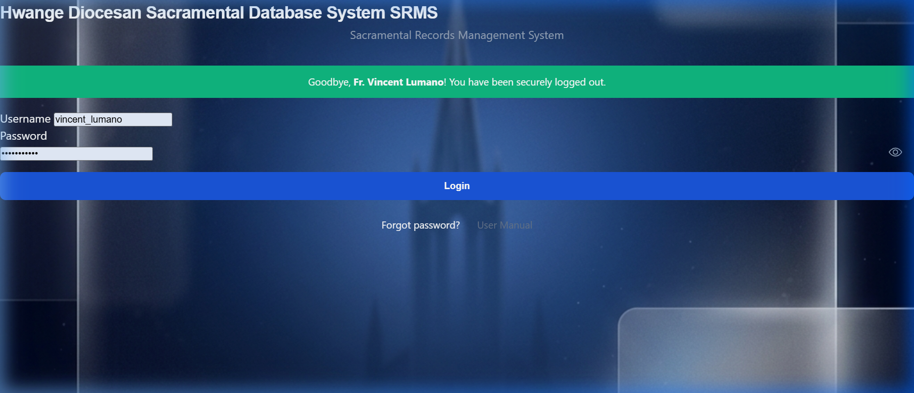

---

## 17. System Policy: Privacy, Terms & Conditions

The Catholic Diocese of Hwange - Zimbabwe operates this Sacramental Records Management System (SRMS) under strict canonical mandates, theological principles, and national data protection regulations. Users are strictly bound by the following conditions:

### 1. Sacramental Privacy & Data Protection Compliance
* **Right to Privacy (Canon 220)**: Under Canon Law, every Christian has a right to their good reputation and the protection of their personal privacy. Unauthorized reading, sharing, or modification of parishioner data is a grave canonical violation.
* **ZDPA Compliance**: The system stores highly sensitive personal data. Parishes must adhere to the **Zimbabwe Data Protection Act (Chapter 12:07)**. No parishioner data may be exported, shared, or printed for non-canonical or non-administrative purposes without explicit episcopal or pastoral consent.
* **Digital Transmission Safety**: Sensitive PDF exports (certificates, OMEGA reports) sent to the Chancery must be encrypted or transferred using secure channels designated by the Chancery.

### 2. Role-Based Access & Credentials Security
* **Individual Accountability**: Each user is assigned a distinct role-based login (e.g., Administrator, Priest, Parish Clerk). Sharing logins or passwords is strictly prohibited.
* **Workstation Surveillance**: Parish clerks must never leave an active session unattended. Always utilize the [Sign Out](#16-secure-session-termination-sign-out) protocol when leaving a workstation to prevent unauthorized individuals from viewing or altering records.
* **Automatic Audit Logging**: All access attempts, record queries, data edits, and certificate prints are automatically recorded in the system audit log. Logs are reviewed monthly by the Diocesan Chancery.

### 3. Cryptographic Security & Data Encryption
* **Database & Credential Hashing**: To prevent unauthorized access in case of database leakage or physical theft of local nodes, all user credentials and session authentication sequences are secured using high-cost cryptographic **bcrypt hashing**.
* **Verification Hashing (SHA-256)**: Sacramental certificates are protected against tampering and forgery through dynamically generated **SHA-256 integrity hashes** and matching secure QR codes. These hashes serve as cryptographic proofs that link the printed transcript directly to the canonical records in the database.
* **Encrypted Backups**: In compliance with weekly database hygiene, all ZIP backups generated via `BACKUP_DATABASE.bat` must be encrypted (e.g., using AES-256 zip encryption) before offsite sync or storage on physical flash drives.

### 4. Professional & Pastoral Ethics in System Usage
* **Pastoral Discretion & Sensitivity**: Sacramental registers capture deeply personal transitions. Clerks and priests must handle records involving sensitive situations (e.g., out-of-wedlock births, adoptive notations, dispensations, and annulments) with the highest level of pastoral charity, discretion, and confidentiality.
* **Stewardship of Truth**: Enforcing database accuracy is an ethical duty. Deliberate misrepresentation or falsification of records to bypass canonical requirements (such as registering sacraments without proof of baptismal status) is a severe ethical and canonical offense.
* **Equitable Administration**: The system must be administered without bias. Access to registers, support ticket resolutions via the Communication Hub, and certificate generation must serve the spiritual good of the faithful in complete equality and pastoral justice.

### 5. Canonical Custody & Intellectual Property
* **Ecclesiastical Ownership**: All database structures, source files, visual manuals, and compiled sacramental tables are the exclusive property of the **Catholic Diocese of Hwange - Zimbabwe**. Parishes operate solely as local custodians of the registers.
* **System Development & Brand Attribution (LumSystems)**: The Sacramental Records Management System (SRMS) was engineered, styled, and customized under the technical leadership of **Rev. Fr. Vincent Lumano (LumSystems)**. The core layouts, including the sidebar elements containing the **LumSystems Mission Creed** (governed by the corporate sentiment *"Honoring Legacy, Illuminating Excellence, Engineering the Future"*) and the **`[3D Diamond]UMSYSTEMS`** vertical signature footer, represent premium design frameworks developed specifically to maintain standardized, cinematic, and responsive diocesan software interfaces.
* **Academic & Commercial Rights**: The intellectual property of **LumSystems** in this codebase is officially licensed to the Hwange Diocesan Administration. Any reuse or duplication of these customized layout systems, database schemas, or PHP modules for external academic presentations, research defenses, or commercial installations without explicit written consent from **Rev. Fr. Vincent Lumano** and the **Diocesan Chancery** is strictly prohibited.
* **Prohibited Actions**: Reverse engineering, decompiling, cloning the codebase for non-diocesan use, or distributing system files to unauthorized third parties is strictly prohibited and subject to legal and canonical action.
* **Modifications Policy**: Any custom alterations to the underlying SQLite database schema (`database.sqlite`) or PHP core modules must be formally petitioned and approved by the Chancery Information Office.

### 6. Legal, Cybersecurity, & Data System Protocols
To ensure full ecclesiastical and statutory alignment, the Hwange Sacramental ERP (v3.0) mandates strict adherence to the following cybersecurity, data system, and national legal boundaries:
* **National Statutory Compliance**: Sacramental registers and faithful profiles represent sensitive personal data under the law. In addition to Canon Law (CIC 1983), the collection, storage, and processing of these digital records are strictly regulated by the **Zimbabwe Cyber Security and Data Protection Act [Act No. 5 of 2021]** and the **Zimbabwe Data Protection Act (ZDPA) [Chapter 12:07]**. Unauthorized data aggregation, disclosure, or transmission constitutes both a canonical offense and a violation of national cyber-security statutes.
* **Malware & Ransomware Defenses**: Local database nodes are highly vulnerable to digital cross-contamination. Under no circumstances may unverified third-party software, cracked licenses, or peer-to-peer sharing applications be executed on the registry workstation. Accessing unsecured web-portals or clicking non-diocesan email attachments is strictly prohibited on node computers.
* **USB Peripheral Quarantine Protocol**: The offline synchronization mechanism relies on transfer via flash drives. All USB storage media used to transfer local SQLite files (`database.sqlite` and backups) must be dedicated exclusively to diocesan sync tasks, physically clean, and fully sanitized via up-to-date anti-virus scan engines prior to connection.
* **Data System Redundancy & Access Controls**: To prevent destructive file system overrides, database relational files and backup directories are marked with restricted access permissions. Manual, un-logged tampering of local directory paths or file replacements is strictly prohibited.
* **Physical Workstation Security**: Workstation laptops and local server boxes housing the live SQLite database node must be physically secured under locks within the parish registry office. Shared office computers must utilize separate Windows user credentials with non-administrator privileges to prevent manual directory deletion or un-audited database swaps by unauthorized staff or guests.
* **Backup Recovery Protocols**: Restoring databases from historic ZIP archives must be conducted only under the direct visual or digital supervision of the Diocesan Chancery Information Office to avoid data synchronization loops or canonical timeline conflicts.

---

## 18. Technical Appendices & Canonical Mapping

This appendix serves as a rigorous bridge between the Code of Canon Law (CIC 1983) and the relational database schemas of the Hwange Sacramental ERP.

### 1. Canonical-to-Database Schema Mapping Table

| Canon Law Clause (CIC 1983) | Canonical Requirement | Relational DB Mapping & Validation Constraints |
| :--- | :--- | :--- |
| **Canon 535 §1** | Retention of Baptism, Marriage, and Death Registers in each parish. | SQLite3 relational tables: `baptism_records`, `marriage_records`, `burial_records`. |
| **Canon 535 §2** | Notations of subsequent sacraments (Marriage, Ordination, Solemn Profession) must be back-referenced on the Baptismal Register. | Foreign keys linking `baptism_records.baptism_id` to `marriage_records.groom_baptism_id` and `marriage_records.bride_baptism_id`. Trigger alerts for notational printouts. |
| **Canon 842 §1** | Baptism is the gate to all other sacraments. No other sacrament can be validly received without it. | Form-level validation and PHP database constraints preventing confirmation, matrimony, or ordination inserts without verifying pre-existing `baptism_id`. |
| **Canon 872-874** | Requirements for valid Confirmation Sponsors (Godparents). | Verification checks in `confirmation_add.php` validating that the sponsor is an active parishioner of valid age and has received all sacraments of initiation. |
| **Canon 1055** | Holy Matrimony requires free consent and prenuptial investigation of both parties. | Integrates prenuptial check fields within the `marriage_records` schema to log the completion of the canonical prenuptial examination. |
| **Canon 1182** | Funeral registers must capture minister, location, and dates of burial and death. | Enforces strict, non-null values for date of death, place of death, and authorized canonical minister in the `burial_records` table. |
| **Canon 220** | Universal right to protection of personal privacy and good name. | Role-Based Access Control (RBAC), secure session termination, automatic audit logging, and Bcrypt cryptographic hashing. |

### 2. Portable Server Stack & Topology

The Hwange Sacramental ERP is custom-built with a resilient, portable, offline-first server architecture designed specifically for rural parish connectivity:

* **Runtime Stack**: PHP 8.2 (portable server runtime) + SQLite 3.42.0.
* **Storage Engine**: Flat-file relational SQLite database (`database.sqlite`), allowing rapid local reads and easy Batched Zip backups.
* **Authentication Security**: Dynamic **bcrypt** hash validation. No raw credentials are ever written to disk or sent over parish networks.
* **Certificate Security**: Real-time generation of cryptographic **SHA-256 integrity hashes** embedded on printed transcripts for physical validation by the Bishop’s Chancery.

---

> [!NOTE]
> *"Ad Majorem Dei Gloriam"* — For the Glory of God.
> For advanced assistance, system rollout, or database restoration, please contact the **Diocesan Information Office, Catholic Diocese of Hwange - Zimbabwe**.

